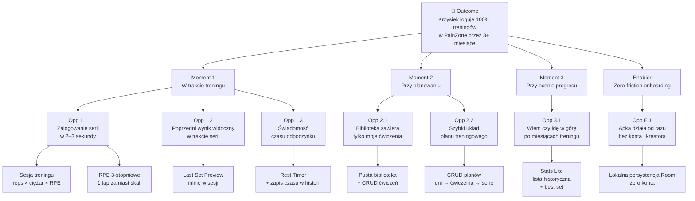

# PRD — PainZone 2.0

> Dokument Fazy 2 procesu designu. Sekcja MoSCoW zatwierdzona: 2026-05-25. OST i user stories — w trakcie. Aktualizuje się wraz z Fazą 3 (User Flows).
>
> Poprzedni dokument: `docs/01-vision.md` · Następny: `docs/03-flows.md`

---

## 1. Kontekst

Wizja (`docs/01-vision.md`) zdefiniowała **co** i **dla kogo**. PRD odpowiada na **jaki scope** wchodzi do MVP, **jaki do v1.1**, **jaki później**, i **co świadomie odpuszczamy na zawsze**.

Trzy decyzje odroczone w wizji §8 zostały zamknięte poniżej w MoSCoW (sekcja 2):
- **Statystyki:** Stats Lite (lista historyczna) → MVP. Pełne wykresy progresu → v1.1.
- **Konto:** brak w MVP. Opcjonalne konto + cloud backup → v1.1+.
- **RPE 3-stopniowe:** MVP.

---

## 2. MoSCoW — priorytetyzacja scope'u

### MUST — MVP, release na Google Play

| Feature | Krótko |
|---------|--------|
| **Biblioteka ćwiczeń (CRUD)** | Start pusta. User dodaje wyłącznie te ćwiczenia których realnie używa. Atrybuty: nazwa + grupa mięśniowa. |
| **Plany treningowe (CRUD)** | Plan = uporządkowana lista dni. Dzień = uporządkowana lista ćwiczeń z biblioteki, każde z: liczbą serii + timerem odpoczynku per ćwiczenie. |
| **Sesja treningu** | Wybór planu i dnia → ekran sesji. Logowanie serii: `reps × ciężar × RPE` (3-stopniowe: łatwa / normalna / ciężka). |
| **"Ile było ostatnio" (killer feature)** | W trakcie wykonywania serii widoczny inline: ostatnia zarejestrowana seria dla *tego samego ćwiczenia* z poprzedniej sesji (reps × ciężar × RPE). |
| **Timer odpoczynku** | Aktywny w sesji między seriami. Zapis rzeczywistego czasu odpoczynku do historii (kontekstualizuje wyniki). |
| **Stats Lite** | Ekran per-ćwiczenie: chronologiczna lista wszystkich serii z ostatnich 90 dni domyślnie + filtr okresu. Best set highlighted. Bez wykresów. |
| **Lokalna persystencja** | Wszystkie dane lokalnie (Room). Zero konta, zero internetu, zero onboardingu. Apka działa od pierwszej sekundy. |

### SHOULD — v1.1

| Feature | Krótko |
|---------|--------|
| **Pełne statystyki** | Wykresy progresu per grupa mięśniowa, skala miesięcy/lat. Decyzja o bibliotece wykresów (Vico / MPAndroidChart / custom Compose) → ADR w Fazie 6, gdy v1.1 wejdzie do scope'u. |
| **Opcjonalne konto + cloud backup** | Zakres do dopięcia w PRD v1.1: backup całości danych vs realny sync między urządzeniami. Decyzja architektoniczna (Firebase / własny backend / Drive API) odroczona. |

### COULD — v2

- Sync między urządzeniami (jeśli v1.1 zostało tylko przy backupie).
- **Wearables** — Garmin Fenix 7s priorytetowo, dalej Apple Watch / Galaxy Watch.
- Integracje z Apple Health / Google Fit.

### WON'T — kiedykolwiek

- ❌ Social feed, leaderboardy, followowanie znajomych.
- ❌ Gotowe plany od trenerów / influencerów / preset templates.
- ❌ Liczenie kalorii, makroskładników, dieta.
- ❌ Cardio, bieganie, joga, crossfit — apka jest **wyłącznie pod klasyczny trening siłowy**.
- ❌ Eksport CSV / PDF.
- ❌ Light mode i wybór motywu — sztywny dark theme.
- ❌ Wielojęzyczność — tylko PL.
- ❌ Wymuszony onboarding z kontem / e-mailem.

---

## 3. Opportunity Solution Tree

OST (Teresa Torres, *Continuous Discovery Habits*, 2021) wymusza łańcuch logiczny **outcome → opportunities → solutions**, walidujący że każdy MUST z §2 służy realnej potrzebie usera, a nie intuicji. Zakres tego drzewa to **wyłącznie MVP** — SHOULD/COULD dostaną własny OST gdy v1.1 wejdzie do scope.

### 3.1 Outcome

> **Krzysiek loguje 100% treningów siłowych w PainZone przez minimum 3 miesiące z rzędu — bez wracania do notatek w telefonie ani innych apek.**

**Metryka:** % treningów zalogowanych w PainZone vs poza nią, mierzone subiektywnie po 3 miesiącach (3 miesiące = jeden cykl planu z persony, vision §3). Próg success: ≥ 95% (1–2 zapomniane sesje akceptowalne).

Źródło outcome'u: vision §6 Personal. Cele Portfolio i Google Play z §6 są *konsekwencjami* tego outcome'u, nie outcome'ami samymi w sobie — apka która jest realnie używana z definicji jest "opublikowana i działa", a repo z tak prowadzonym procesem designu automatycznie pokazuje produkt-thinking.

### 3.2 Diagram OST

### 3.3 Narracja per branch

#### Moment 1 — W trakcie treningu

> **Outcome contribution:** Jeśli ten moment ma jakąkolwiek tarcie (UI ceremonialne, brak kontekstu poprzednich wyników, gubienie czasu odpoczynku), user wraca do notatek. To **najważniejszy** branch — vision §4 oznacza go jako "maksymalna prostota i szybkość".

- **Opp 1.1 — Zalogowanie serii w 2–3 sekundy.**
  *Potrzeba (persona):* „Jestem między seriami, mam 60–180 sekund do następnej. Otwarcie apki, znalezienie ćwiczenia, kliknięcie 'dodaj serię', wpisanie reps+ciężar — to musi być automatyczne, nie ceremonia."
  *Solutions:* Sesja treningu (logowanie `reps × ciężar × RPE` na jednym ekranie); RPE 3-stopniowe zamiast skali 1–10 (1 tap zamiast 2–3).
  *Najważniejszy assumption →* **A2** (sekcja 3.4).

- **Opp 1.2 — Poprzedni wynik widoczny w trakcie serii.**
  *Potrzeba (persona):* „W trakcie wykonywania serii muszę szybko zdecydować *czy próbuję pobić*, czy *trzymam ten sam ciężar*. Bez kontekstu zgaduję."
  *Solution:* Last Set Preview inline w sesji — killer feature z vision §5.
  *Najważniejszy assumption →* **A3** (sekcja 3.4).

- **Opp 1.3 — Świadomość czasu odpoczynku.**
  *Potrzeba (persona):* „Za pół roku, patrząc na 'max na klatę', chcę wiedzieć czy robiłem to z 2 min przerwami czy 5 min — bo to *zupełnie inny* wynik."
  *Solution:* Rest Timer + zapis rzeczywistego czasu odpoczynku do historii (LoggedSet).
  *Assumption (MEDIUM):* „Czas odpoczynku w historii rzeczywiście będzie mi się przydawał przy Stats Lite." Walidacja: pasywna, przez używanie po 3 miesiącach.

#### Moment 2 — Przy planowaniu

> **Outcome contribution:** Bez sensownego planu user logującą się sesją bez kontekstu (jakie ćwiczenie, ile serii, jaki timer). To tworzy bazę dla Momentu 1.

- **Opp 2.1 — Biblioteka zawiera tylko moje ćwiczenia.**
  *Potrzeba (persona):* „Hevy/Strong mają setki ćwiczeń których nie używam. Moja realna lista to ~20. Chcę widzieć tylko te 20."
  *Solution:* Pusta biblioteka na start + CRUD ćwiczeń (Exercise z `name` + `MuscleGroup`).
  *Assumption (LOW):* „Pusta biblioteka na pierwszym uruchomieniu nie zniechęca." Walidacja: pasywna, pierwsze użycie.

- **Opp 2.2 — Szybki układ planu treningowego.**
  *Potrzeba (persona):* „Mam swój plan w głowie (Push/Pull/Nogi, każde ćwiczenie 3–4 serie, timer 2–3 min). Wprowadzenie go do apki nie może trwać godziny."
  *Solution:* CRUD planów (TrainingPlan → PlannedDay → PlannedExercise z liczbą serii i Rest Timerem **per ćwiczenie**).
  *Assumption (LOW):* „Timer per ćwiczenie (nie per plan) jest właściwym poziomem granularności." Walidacja: pierwsze 2–3 plany — jeśli zawsze ustawiasz ten sam czas wszędzie, warto rozważyć default + override w v1.1.

#### Moment 3 — Przy ocenie progresu

> **Outcome contribution:** Persona po 3 miesiącach planu chce wiedzieć **czy szło w górę**. Brak tego = apka czuje się jak smart notes. Z tym = realny dziennik progresu.

- **Opp 3.1 — Wiem czy idę w górę po miesiącach treningu.**
  *Potrzeba (persona):* „Zacząłem 3 miesiące temu plan. Chcę odpowiedzieć: *Na wyciskanie robię teraz 80×5, a wtedy 75×5 — czy posunąłem się?* — w 10 sekund, na ekranie tego ćwiczenia."
  *Solution:* Stats Lite — chronologiczna lista wszystkich LoggedSet per ćwiczenie, 90 dni domyślnie + filtr okresu, best set highlighted. **Bez wykresów** (pełne wykresy progresu per grupa mięśniowa → v1.1).
  *Najważniejszy assumption →* **A1** (sekcja 3.4).

#### Enabler — Zero-friction onboarding

> **Outcome contribution:** Pre-requirement dla wszystkich trzech momentów. Jeśli pierwsze uruchomienie wymaga konta/onboardingu, user nie dotrze nawet do Momentu 1.

- **Opp E.1 — Apka działa od razu bez konta i kreatora.**
  *Potrzeba (persona):* „Instaluję apkę o 18:30, idę na siłownię o 19:00. Nie mam czasu na rejestrację, weryfikację e-maila ani tutorial."
  *Solution:* Lokalna persystencja (Room), zero konta wymaganego, zero internetu wymaganego, zero ekranów wymuszonych przed głównym UI.
  *Assumption (LOW):* „Lokalna persystencja wystarcza na MVP — telefon się nie zgubi, dane się nie skorumpują." Mitygacja w v1.1 (opcjonalne konto + cloud backup).

### 3.4 Top 3 assumption tests do walidacji na MVP

Spośród wszystkich opportunities — trzy gdzie "źle założyłem" boli najmocniej. Każdy jest falsyfikowalny (jasne kryterium tak/nie) i każdy daje się przetestować **na żywym MVP**, bez budowania osobnego prototypu.

#### A1 (HIGHEST) — Stats Lite wystarcza do oceny progresu

**Założenie:** Lista historyczna serii per ćwiczenie (bez wykresu) wystarcza, żeby po miesiącach treningu odpowiedzieć "czy idę w górę".

**Dlaczego ryzykowne:** To jest *cała* podstawa decyzji "Stats Lite w MVP zamiast pełnych wykresów". Jeśli założenie jest fałszywe — Stats Lite jest martwym MUST'em, persona i tak wraca do mental cherry-picking albo opuszcza apkę przy ekranie progresu.

**Test:** Po 3 miesiącach realnego używania MVP odpowiedz sam sobie binarnie: *"Czy umiem, otwierając Stats Lite dla wyciskania, w ≤ 10 sekund odpowiedzieć: robię teraz więcej / mniej / tyle samo niż 3 miesiące temu?"*

**Falsyfikacja:** Jeśli "nie" lub "ledwo" → wykresy progresu awansują z v1.1 do v1.05 (priorytet 1 po release MVP).

#### A2 (HIGH) — Logowanie serii w 2–3 sekundach jest osiągalne

**Założenie:** Finalne UI sesji pozwala zalogować pojedynczą serię (`reps × ciężar × RPE`) w 2–3 sekundach mierzonego czasu.

**Dlaczego ryzykowne:** "Minimum kliknięć" z USP jest punktem różnicującym vs Hevy/Strong. Jeśli realnie zajmuje to 6–8 sekund, USP się rozpada i persona wraca do notatek (3 sekundy).

**Test:** Po pierwszym working MVP — realna sesja, stoper na pierwsze 10 serii (od pierwszego tapa po otwarciu sesji do zapisanej serii). Oblicz medianę.

**Falsyfikacja:** Mediana > 4 sekundy → refactor UX sesji (większe pola, smart defaults z planu, swipe gestures) staje się P0 przed Google Play release.

#### A3 (HIGH) — Last Set Preview inline wystarcza w trakcie sesji

**Założenie:** Widok poprzedniej serii (jedna linia inline) wystarcza, żeby w trakcie wykonywania serii podjąć decyzję o ciężarze — nie potrzebujesz wykresu/historii w samej sesji.

**Dlaczego ryzykowne:** Jeśli założenie jest fałszywe, user wychodzi z ekranu sesji żeby sprawdzić starszy wynik → traci timer odpoczynku, traci flow, w skrajnym przypadku traci sesję. Wtedy Last Set Preview to *fasada* feature'a, nie realny killer.

**Test:** Po 20 sesjach z MVP zapytaj: *"Czy choć raz w trakcie sesji wyszedłeś z ekranu treningu do Stats Lite żeby sprawdzić starszy wynik?"* — odpowiedź binarna.

**Falsyfikacja:** "Tak ≥ 3 razy" → Last Set Preview rozbudowuje się o dropdown/sheet z ostatnimi 3–5 wynikami inline, bez opuszczania sesji.

#### Assumption tests pozostałych opportunities

LOW risk, walidują się pasywnie przez używanie. Krótka lista:
- **Opp 1.3** (czas odpoczynku w historii) — przydaje się dopiero przy Stats Lite po miesiącach. Walidacja: czy po 3 mies. otwierając historię świadomie patrzysz na czasy odpoczynku.
- **Opp 2.1** (pusta biblioteka) — walidacja: pierwsze użycie. Czy frustruje, że nic nie ma.
- **Opp 2.2** (timer per ćwiczenie) — walidacja: pierwsze 2–3 plany. Czy zawsze ustawiasz ten sam czas → wtedy default + override do v1.1.
- **Opp E.1** (zero-friction onboarding) — własna obserwacja przy pierwszej instalacji.

---

## 4. User Stories — MVP

> _W trakcie. Format: "Jako [persona], chcę [akcja], żeby [benefit]" + acceptance criteria. Po jednej grupie stories per feature z MUST §2._

---

## Referencje

- Wizja: `docs/01-vision.md`
- Proces: `docs/00-process.md`
- Glossary: `docs/glossary.md`
- Następny dokument: `docs/03-flows.md` (Faza 3 — User Flows + IA)
