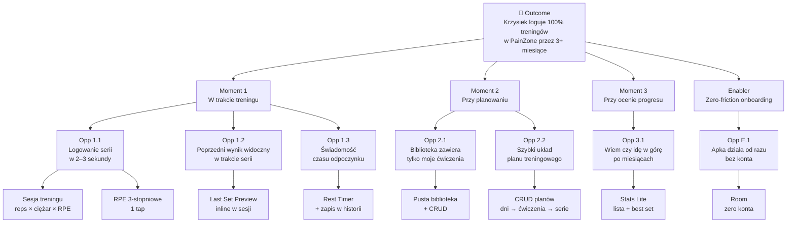

# PRD — PainZone 2.0

> TL;DR: MoSCoW scope + OST (outcome → solutions) + 7 User Stories z AC dla MVP.
>
> Zatwierdzony: 2026-05-26.

---

## 1. MoSCoW

### MUST — MVP

| Feature | Krótko |
|---------|--------|
| **Biblioteka ćwiczeń (CRUD)** | Pusta na start. Atrybuty: nazwa + grupa mięśniowa. |
| **Plany treningowe (CRUD)** | Plan = lista dni. Dzień = ćwiczenia z biblioteki + serie + timer per ćwiczenie. |
| **Sesja treningu** | Wybór planu/dnia → logowanie `reps × ciężar × RPE` (3-stopniowe). |
| **Last Set Preview** | Inline w sesji: ostatnia seria tego ćwiczenia z poprzedniej sesji. |
| **Timer odpoczynku** | Auto-start po serii, rzeczywisty czas zapisany w historii. |
| **Stats Lite** | Per ćwiczenie: lista serii 90d + filtr + best set. Bez wykresów. |
| **Lokalna persystencja** | Room. Zero konta, zero internetu, zero onboardingu. |

### SHOULD — v1.1

| Feature | Krótko |
|---------|--------|
| **Pełne statystyki** | Wykresy progresu per grupa mięśniowa. Biblioteka → ADR Faza 6. |
| **Konto + cloud backup** | Zakres do PRD v1.1. Decyzja architektoniczna odroczona. |

### COULD — v2

Sync między urządzeniami · Wearables (Garmin Fenix 7s priorytetowo) · Apple Health / Google Fit.

### WON'T

❌ Social feed / leaderboardy · Gotowe plany · Kalorie / makro · Cardio / joga · Eksport CSV/PDF · Light mode · Wielojęzyczność.

---

## 2. Opportunity Solution Tree

**Outcome:** Krzysiek loguje 100% treningów siłowych w PainZone przez min. 3 miesiące z rzędu — bez wracania do notatek.

### Assumption tests

| Test | Ryzyko | Jak mierzyć | Falsyfikacja |
|------|--------|-------------|--------------|
| **A1** Stats Lite wystarczy do oceny progresu | HIGHEST | Po 3 mies: w ≤ 10s odpowiem "czy idę w górę"? | Nie → wykresy awansują do v1.05 |
| **A2** Logowanie serii w ≤ 3s | HIGH | Po MVP: stoper na 10 serii, mediana | Mediana > 4s → refactor UX sesji P0 przed Play |
| **A3** Last Set Preview wystarczy w sesji | HIGH | Po 20 sesjach: czy wychodzisz z sesji do Stats? | ≥ 3 razy → preview rozbudować o 3–5 wyników |

---

## 3. User Stories — MVP

### 4.1 Biblioteka ćwiczeń (CRUD)

**Story:** Zarządzam własną listą ćwiczeń żeby biblioteka miała tylko moje ~20 pozycji.

**AC1 — Dodanie z pustej biblioteki**
*Given* pusta biblioteka
*When* dodaję "Wyciskanie na ławce poziomej" + wybieram grupę "Klatka"
*Then* ćwiczenie zapisuje się i jest gotowe w pickerze planów

**AC2 — Walidacja: nazwa + grupa obowiązkowe**
*Given* tworzę / edytuję ćwiczenie
*When* próbuję zapisać bez nazwy lub grupy
*Then* "Zapisz" disabled dopóki oba pola wypełnione

**AC3 — Edycja propaguje się wszędzie**
*Given* "Wycoskanie" (literówka) w 2 planach i 12 sesjach
*When* zmieniam nazwę na "Wyciskanie"
*Then* nowa nazwa wszędzie — bez utraty żadnej serii

**AC4 — Usunięcie z planem / historią**
*Given* ćwiczenie referencjonowane w aktywnym planie lub historii
*When* potwierdzam usunięcie
*Then* ostrzeżenie ile planów/sesji używa; po potwierdzeniu znika z biblioteki, LoggedSet w Stats Lite czytelny (patrz 4.6 AC5). Strategia soft/hard delete → Faza 5.

---

### 4.2 Plany treningowe (CRUD)

**Story:** Składam plan z dni i ćwiczeń żeby sesja miała gotowy kontekst.

**AC1 — Stworzenie planu z dniami**
*Given* ≥5 ćwiczeń w bibliotece
*When* tworzę plan "Push/Pull/Nogi" z 3 dniami i 4–6 ćwiczeniami per dzień
*Then* plan zapisuje się z zachowaną kolejnością dni i ćwiczeń

**AC2 — Parametry per ćwiczenie (nie globalnie)**
*Given* dodaję "Wyciskanie" do dnia "Push"
*When* ustawiam serie=4, timer=3:00
*Then* parametry dla tego ćwiczenia w tym planie — to samo ćwiczenie w innym planie może mieć inne wartości

**AC3 — Edycja kolejności**
*Given* dzień "Push" ma 5 ćwiczeń
*When* przenoszę "Rozpiętki" z poz. 5 na poz. 2
*Then* nowa kolejność zapisana i aktywna od następnej sesji

**AC4 — Edycja po zarejestrowanych sesjach**
*Given* plan z 8 Completed sesjami
*When* dodaję ćwiczenie lub zmieniam serie
*Then* zmiany tylko w przyszłych sesjach; 8 historycznych nienaruszone

---

### 4.3 Sesja treningu

**Story:** Loguję serię w ≤ 3 sekundy żeby nie tracić timera i flow.

**AC1 — Start sesji z planu**
*Given* aktywny plan z 3 dniami
*When* wybieram plan → dzień "Push" → "Zacznij sesję"
*Then* ekran sesji z listą ćwiczeń; pierwsze aktywne; pre-fill: serie z planu, ciężar z ostatniej sesji

**AC2 — Logowanie ≤ 3s**
*Given* pre-fill ciężar=80kg
*When* wpisuję reps=8, zostawiam ciężar, taguję RPE "Normalna", potwierdzam
*Then* seria zapisana w ≤ 3s; Rest Timer startuje automatycznie

**AC3 — Edycja świeżej serii**
*Given* zapisałem błąd (80 zamiast 90 kg)
*When* tappuję na serię
*Then* edytuję dowolne pole; nadpisuje istniejący LoggedSet

**AC4 — Pauza i kontynuacja**
*Given* sesja InProgress, zalogowałem 3/12 serii
*When* zamykam apkę na 30 min i wracam
*Then* sesja czeka InProgress, wszystkie 3 serie zachowane

**AC5 — Zakończenie**
*Given* seria zalogowane
*When* "Zakończ sesję"
*Then* → Completed (read-only); wracam do S1 z potwierdzeniem

---

### 4.4 Last Set Preview

**Story:** Widzę inline poprzedni wynik żeby w 2s zdecydować "próbuję pobić czy trzymam".

**AC1 — Preview od aktywacji ćwiczenia**
*Given* "Wyciskanie" z historią
*When* ćwiczenie aktywne
*Then* inline: "8 × 80 kg / Normalna — 3 dni temu"

**AC2 — Brak historii = explicit komunikat**
*Given* nowe ćwiczenie bez historii
*When* sesja na tym ćwiczeniu
*Then* "Brak poprzedniej sesji" — nie pusty placeholder

**AC3 — "Ostatnia" = ostatnia seria z ostatniej Completed sesji**
*Given* ostatnia sesja miała 3 serie: 8×80, 8×80, 6×80
*When* nowa sesja
*Then* preview = 6×80 (ostatnia chronologicznie, nie best)

**AC4 — Preview zawsze widoczny, bez nawigacji**
*Given* aktywna seria
*When* patrzę na preview
*Then* jednoliniowy, widoczny stale — bez tapa / dropdown / opuszczania ekranu

---

### 4.5 Timer odpoczynku

**Story:** Auto-timer po serii + czas w historii żeby za 6 mies. wiedzieć "max z 2 min czy 5 min".

**AC1 — Auto-start**
*Given* zalogowałem serię
*When* zapisuje się
*Then* timer startuje z czasem z planu dla tego ćwiczenia

**AC2 — Zapis rzeczywistego czasu**
*Given* plan=3:00
*When* po 2:14 klikam "kolejna seria"
*Then* `restBeforeSeconds=134` w kolejnym LoggedSet

**AC3 — Sygnał + dalsze mierzenie**
*Given* timer osiąga 3:00
*When* user nie kliknął
*Then* wibracja + opcjonalny dźwięk; timer **dalej liczy** do kliknięcia

**AC4 — Pierwsza seria bez rest**
*Given* pierwsza seria ćwiczenia w sesji
*When* loguje
*Then* `restBeforeSeconds=null`; Stats Lite pokazuje "—"

---

### 4.6 Stats Lite

**Story:** Otwieram ćwiczenie i w ≤ 10s odpowiadam "czy idę w górę vs 3 mies. temu".

**AC1 — Lista 90 dni domyślnie**
*Given* 5 mies. historii wyciskania
*When* otwieram Stats Lite
*Then* chronologiczna lista LoggedSet (najnowsze góra): data, reps × ciężar × RPE, rest

**AC2 — Filtr okresu**
*Given* jestem w Stats Lite
*When* zmieniam filtr: 30d / 90d / rok / wszystko
*Then* lista re-renderuje w < 200ms

**AC3 — Best set highlighted**
*Given* N serii w zakresie
*When* przeglądam
*Then* best set (najwyższy 1RM est., formuła → Faza 5) wyróżniony

**AC4 — Bez wykresów**
*Given* Stats Lite
*When* eksploruję
*Then* tylko lista + filtr — żadnych wykresów

**AC5 — Usunięte ćwiczenia**
*Given* ćwiczenie usunięte z biblioteki
*When* przeglądasz Stats Lite
*Then* widoczne z markerem "usunięte"; historia read-only

---

### 4.7 Zero-friction onboarding

**Story:** Instaluję i jestem w głównym UI od razu — bez konta, internetu, tutoriala.

**AC1 — Pierwsze uruchomienie wprost do UI**
*Given* pierwsza instalacja
*When* apka ładuje
*Then* główny ekran — bez ekranu logowania / powitalnego / coach marks

**AC2 — Pełna funkcjonalność offline**
*Given* telefon w trybie samolotowym
*When* CRUD + sesja
*Then* identycznie jak online

**AC3 — Brak zbierania danych konta**
*Given* eksploruję wszystkie MUST features
*When* korzystam
*Then* nigdy nie pyta o e-mail / hasło / ID

**AC4 — Persystencja po restarcie**
*Given* 15 ćwiczeń, 2 plany, 30 sesji
*When* restartuję telefon
*Then* dane w identycznym stanie

---

## Referencje

`docs/01-vision.md` · `docs/03-flows.md` · `docs/glossary.md`