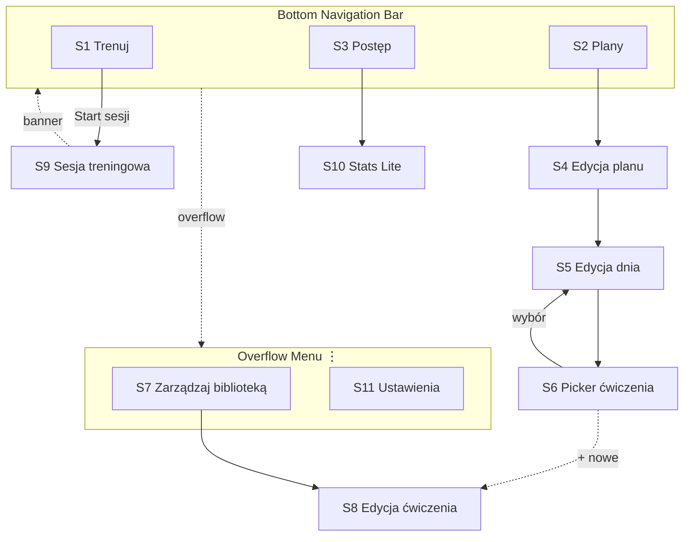
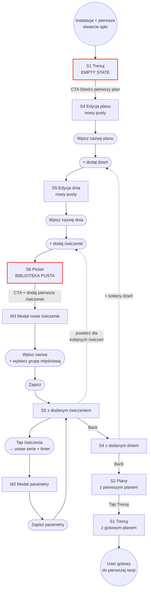
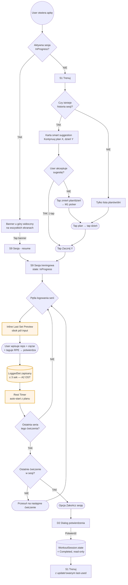
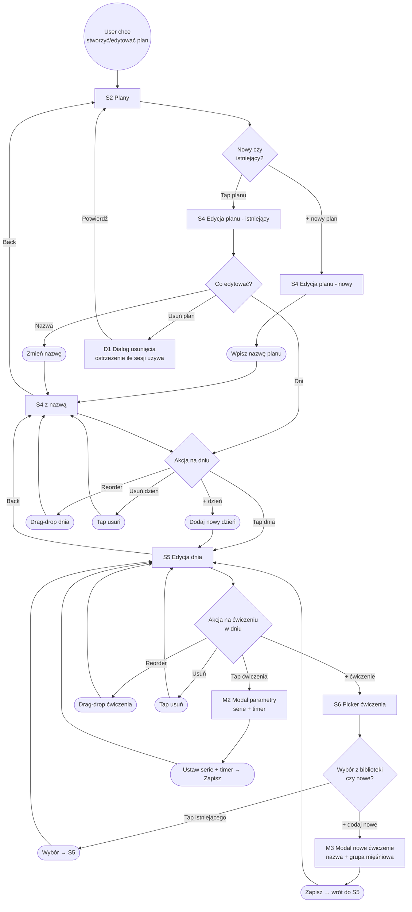
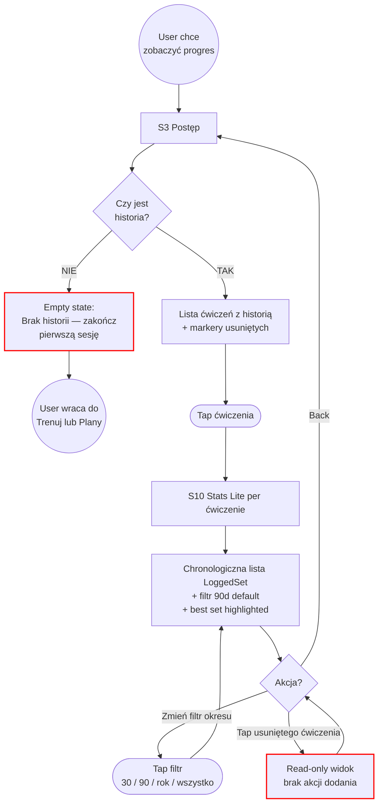

# User Flows + Information Architecture — PainZone 2.0

> Dokument Fazy 3 procesu designu. Zatwierdzony: 2026-05-26. Aktualizuje się wraz z Fazą 4 (Wireframes Lo-Fi).
>
> Poprzedni dokument: `docs/02-prd.md` · Następny: `docs/04-wireframes.md`

---

## 1. Kontekst

Faza 2 (PRD) zdefiniowała **co** apka robi (7 user stories w MUST §2). Faza 3 odpowiada na **jak strukturalnie** te feature'y są zorganizowane — wzorzec nawigacji, top-level destinations, inwentarz ekranów, flowy top scenariuszy.

**Mapowanie dalej w dół procesu:**
- Wireframes (Faza 4) mapują 1:1 do tego dokumentu — jeden lo-fi frame per ekran z §4, każdy flow z §6 powinien dać się przejść klikając przez wireframes.
- Compose `NavHost` (Faza 6) mapuje 1:1 do navigation map z §5.

---

## 2. Competitive analysis — IA reference

Świadome borrowowanie struktury nawigacji od reference apek (Hevy, Strong, FitNotes, Jefit), świadome odrzucanie elementów które kolidują z MoSCoW WON'T (PRD §2). Reverse-engineering wzorca który "działa" zamiast wymyślania z głowy.

### 2.1 Tabela porównawcza top-level nav

| App | Wzorzec nav | Top-level destinations | Start sesji | Notatki |
|-----|-------------|------------------------|-------------|---------|
| **Hevy** | Bottom bar 4–5 | Home (feed społecznościowy) · Workout · Exercises · Profile · (+ Routines) | Centralny tab "Workout" | Social-heavy, "Discover" promuje preset plany |
| **Strong** | Bottom bar 3–4 | History · Workout · Exercises (+ Profile w overflow) | Centralny tab "Workout" | Najczystszy z konkurencji — minimalny chrome |
| **FitNotes** | Drawer (M2 legacy) | Workouts (kalendarz) · Exercises · Statistics · Settings · Backup | Z kalendarza → tap daty | Stare UI, drawer = 2 tap żeby zmienić sekcję |
| **Jefit** | Bottom + drawer hybrid | Home (dashboard) · Train · Plan · Stats · Community | Tab "Train" | Najmocniej przeładowane, dashboard z wieloma kartami |

### 2.2 Co bierzemy z konwencji branżowej

- ✅ **Bottom navigation bar** (3 z 4 apek) — M3 standard, znajomy mental model, thumb-friendly jednoręcznie.
- ✅ **Workout / Train jako prominentny entry** (3 z 4 apek) — najczęstsza akcja zasługuje na własny slot.
- ✅ **Historia / Stats jako osobna destination** (3 z 4 apek) — "ocena progresu" to use case sam w sobie, nie sub-strona.

### 2.3 Co świadomie odrzucamy (na podstawie MoSCoW WON'T)

- ❌ **Home / Feed / Community** (Hevy, Jefit) → WON'T "social feed" → -1 slot w bottom barze.
- ❌ **Discover / Routines jako preset templates browser** (Jefit, Hevy) → WON'T "gotowe plany od trenerów" → -1 slot.
- ❌ **Profile jako rozbudowane achievements** (Hevy, Jefit) → MVP nie ma kont → -1 slot.
- ❌ **Drawer** (FitNotes) → M3 legacy dla ≤ 5 destinations, gorzej jedną ręką → wykluczone.

### 2.4 Co robimy inaczej (portfolio-distinct)

- 🎯 **Tylko 3 zakładki** (vs 4–5 u konkurencji) — świadomie wąsko. Logika: bez social/preset/profile po prostu nie ma czym zapełnić więcej slotów.
- 🎯 **Biblioteka ćwiczeń schowana** — w referencyjnych apkach to top-level (bo ich biblioteka ma setki ćwiczeń do przeszukiwania); u nas ~20 user-owned ćwiczeń + CRUD to rzadka aktywność = lepsze miejsce w overflow + picker przy planach.
- 🎯 **Brak FAB** — "Trenuj" jest zakładką w bottom barze (1-tap z każdego miejsca), więc pływający przycisk byłby zbędny i wprowadzałby wizualny szum.

---

## 3. Decyzja IA

### 3.1 Tabela decyzji

| Element | Decyzja | Uzasadnienie |
|---------|---------|--------------|
| **Wzorzec nav** | Bottom navigation bar | §2.2 — branżowy default, thumb-friendly |
| **Liczba zakładek** | **3: Trenuj / Plany / Postęp** | §2.4 — świadomie wąsko vs konkurencja |
| **Aktywna sesja** | Persistent banner u góry (tylko gdy `WorkoutSession.state == InProgress`) | Match z PRD §4.3 AC4 (wyjdź-i-wróć) |
| **Biblioteka ćwiczeń** | **Schowana** — picker w Plany + overflow menu jako "Zarządzaj biblioteką" | §2.4 — rzadka aktywność nie zasługuje na top-level slot |
| **Settings** | Overflow menu (⋮ prawy górny) | MVP Settings praktycznie puste (dark sztywny, PL only, brak konta) |
| **FAB "Zacznij trening"** | **Brak** | "Trenuj" jest zakładką — 1-tap z każdego miejsca |
| **Zachowanie "Trenuj"** | **Hybryd**: smart sugestia u góry + pełna lista poniżej | Wzmacnia USP "min. kliknięć" bez wykluczania manual pick |
| **Wizualny styl bottom bara** | **Odroczone do Fazy 4** | Decyzja stylistyczna ≠ strukturalna |

### 3.2 ASCII mockup struktury

**Stan default (brak aktywnej sesji):**

```
┌──────────────────────────────────┐
│   PainZone               [⋮]     │  ← top app bar + overflow
├──────────────────────────────────┤    (Zarządzaj biblioteką, Ustawienia)
│                                  │
│   (content per zakładka)         │
│                                  │
│                                  │
├──────────────────────────────────┤
│  [Trenuj]  [Plany]  [Postęp]    │  ← bottom navigation bar (3 tabs)
└──────────────────────────────────┘
```

**Stan z aktywną sesją:**

```
┌──────────────────────────────────┐
│ ⏺ Aktywna: Push 3/12  →         │  ← persistent banner (tap → resume)
├──────────────────────────────────┤
│   PainZone               [⋮]     │
├──────────────────────────────────┤
│   (content per zakładka)         │
├──────────────────────────────────┤
│  [Trenuj]  [Plany]  [Postęp]    │
└──────────────────────────────────┘
```

**Zakładka Trenuj (zachowanie hybrid):**

```
┌──────────────────────────────────┐
│   Trenuj                 [⋮]     │
├──────────────────────────────────┤
│ ╭──────────────────────────────╮ │
│ │ 🔁 Kontynuuj Push/Pull/Nogi  │ │  ← smart suggestion card
│ │ Następny dzień: Pull         │ │
│ │ Ostatnio: Push, 3 dni temu   │ │
│ │            [▶ Zacznij Pull]  │ │
│ ╰──────────────────────────────╯ │
│                                  │
│  Albo wybierz ręcznie:           │
│                                  │
│  ▾ Push/Pull/Nogi                │
│      · Push                      │
│      · Pull                      │
│      · Nogi                      │
│  ▾ Upper/Lower 4-day             │
│      · Upper A                   │
│      · ...                       │
├──────────────────────────────────┤
│  [Trenuj]  [Plany]  [Postęp]    │
└──────────────────────────────────┘
```

---

## 4. Inwentarz ekranów

Łącznie 11 ekranów + 5 modali/dialogów. Mapuje 1:1 do wireframes (Faza 4) i destinations w Compose `NavHost` (Faza 6).

### 4.1 Top-level (bottom bar destinations)

| # | Ekran | Purpose | Entry points | Exit points | Mapowanie do PRD §4 |
|---|-------|---------|--------------|-------------|--------------------|
| **S1** | **Trenuj** (home) | Start sesji — smart suggestion + lista planów/dni | Default po starcie apki · Tap zakładki | Tap [Start] / planu / dnia → S9 · Tap banner → S9 (resume) | 4.3 (start), implicit 4.2 (przegląd planów) |
| **S2** | **Plany** | Lista planów + entry do CRUD | Tap zakładki | "+ nowy plan" → S4 · Tap planu → S4 | 4.2 |
| **S3** | **Postęp** | Lista ćwiczeń z historią | Tap zakładki | Tap ćwiczenia → S10 | 4.6 (browse) |

### 4.2 Sub-screens (zagłębione)

| # | Ekran | Purpose | Entry points | Exit points | Mapowanie |
|---|-------|---------|--------------|-------------|-----------|
| **S4** | **Edycja planu** | CRUD planu (nazwa) + zarządzanie dniami (add / reorder / delete) | S2 (tap planu lub + nowy) | Tap dnia → S5 · "+ dzień" → S5 · "Usuń plan" → D1 · Back → S2 | 4.2 (AC1, AC3, AC4) |
| **S5** | **Edycja dnia planu** | CRUD nazwy dnia + zarządzanie ćwiczeniami (add / reorder / delete + parametry) | S4 (tap dnia lub + dzień) | "+ ćwiczenie" → S6 · Tap ćwiczenia → M2 · Back → S4 | 4.2 (AC2, AC3) |
| **S6** | **Picker ćwiczenia z biblioteki** | Wybór ćwiczenia + opcja "+ dodaj nowe" inline | S5 ("+ ćwiczenie") | Tap ćwiczenia → wrót do S5 · "+ dodaj nowe" → M3 → wrót do S5 | 4.1 (przez 4.2) |
| **S7** | **Zarządzaj biblioteką** | Lista wszystkich ćwiczeń + CRUD (globalna edycja / usuwanie) | Overflow (⋮) → "Zarządzaj biblioteką" | Tap ćwiczenia → S8 · "+ nowe" → S8 · "Usuń" → D1 · Back → poprzedni ekran | 4.1 (główny entry) |
| **S8** | **Edycja ćwiczenia w bibliotece** | Edycja nazwy + grupy mięśniowej | S7 (tap lub + nowe) | Zapisz → wrót do S7 · Back → S7 | 4.1 (AC1, AC2, AC3) |
| **S9** | **Sesja treningowa** | Logowanie serii (reps × ciężar × RPE) z Last Set Preview inline + Rest Timer | S1 (Start) · Banner (resume) | "Zakończ sesję" → D2 → wrót do S1 · Back / app close → sesja zostaje InProgress | 4.3, 4.4, 4.5 |
| **S10** | **Stats Lite per ćwiczenie** | Chronologiczna lista serii + filtr okresu + best set highlighted | S3 (tap ćwiczenia) | Back → S3 | 4.6 |
| **S11** | **Ustawienia** | "O aplikacji" + Reset danych (MVP minimum) | Overflow (⋮) → "Ustawienia" | Back → poprzedni ekran | (meta — brak user story) |

### 4.3 Modalne / dialogi

| # | Element | Purpose | Trigger |
|---|---------|---------|---------|
| **M1** | Picker plan/dzień | Manual override smart sugestii w S1 | Tap "zmień plan/dzień" w karcie smart suggestion |
| **M2** | Edycja parametrów ćwiczenia w planie | Edycja liczby serii + timera odpoczynku per `PlannedExercise` | Tap ćwiczenia w S5 |
| **M3** | Modal dodania nowego ćwiczenia | Inline dodanie ćwiczenia do biblioteki bez opuszczania flow planu | "+ dodaj nowe" w S6 |
| **D1** | Dialog potwierdzenia usunięcia | Ostrzeżenie + lista referencji (plany / sesje używające danego elementu) | "Usuń" w S4 (plan) lub S7 (ćwiczenie) |
| **D2** | Dialog "Zakończ sesję" | Potwierdzenie zakończenia (sesja → `Completed`, read-only) | "Zakończ sesję" w S9 |

### 4.4 Empty states (stany ekranów, nie osobne ekrany)

- **S1 (Trenuj) bez historii:** karta smart suggestion ukryta, widoczna tylko lista planów. Jeśli brak planów → CTA "Stwórz pierwszy plan" → S4.
- **S2 (Plany) pusto:** centralny CTA "Stwórz pierwszy plan" → S4.
- **S3 (Postęp) pusto:** komunikat "Brak historii — zakończ pierwszą sesję żeby zobaczyć postęp" (per user story 4.7 AC1 — apka działa od razu, ale Postęp jest data-driven).
- **S6 (Picker) z pustą biblioteką:** explicit "Biblioteka pusta — [+ dodaj pierwsze ćwiczenie]" (per 4.1 AC1, 4.4 AC2 — explicit komunikat, nie pusty placeholder).
- **S7 (Zarządzaj biblioteką) pusto:** centralny CTA "Dodaj pierwsze ćwiczenie" → S8.

---

## 5. Navigation map

High-level mapa wszystkich ekranów i strzałek nawigacji. Nie pokazuje decyzji UX wewnątrz ekranów — tylko "z ekranu A można pójść do ekranu B".



**Legenda:**
- Strzałka ciągła `-->` = nawigacja "w głąb" (push na nav stack)
- Strzałka kropkowana `-.->` = nawigacja kontekstualna (overflow menu, persistent banner)
- `Bottom Navigation Bar` = top-level tabs (swap freely 1-tap między sobą)

---

## 6. Flow diagrams — 4 top scenariusze

Per `docs/00-process.md` §68. Każdy flow w Mermaid `flowchart TD`. Konwencja:
- **Prostokąt** `[...]` = ekran (z `Sn` ID z §4)
- **Romb** `{...}` = decision point
- **Stadium / pill** `([...])` = user action (tap, swipe, input)
- **Cylinder** `[(...)]` = zmiana stanu / write do bazy
- **Koło** `((...))` = start / end flow'u
- **Czerwona ramka** = empty state / edge case (klasa `errorState`)
- **Pomarańczowa ramka** = krytyczny node dla USP / OST assumption (klasa `criticalNode`)

### 6.1 Pierwsze uruchomienie

> Pokrywa user stories: **4.7** (zero-friction onboarding), **4.1** + **4.2** (implicit przez "dodaj pierwsze").



### 6.2 Zacznij trening (najgęstszy)

> Pokrywa: **4.3** (sesja), **4.4** (Last Set Preview), **4.5** (Rest Timer). Krytyczny dla walidacji **A2** i **A3** z OST (PRD §3.4).



### 6.3 Stwórz / edytuj plan

> Pokrywa: **4.2** (CRUD planów), implicit **4.1** (CRUD ćwiczeń przez picker w S6).



### 6.4 Zobacz progres

> Pokrywa: **4.6** (Stats Lite). Walidacja **A1** z OST (HIGHEST risk).



---

## 7. Open questions / forward-looking notes

Decyzje świadomie odroczone do dalszych faz:

| # | Question | Odroczone do |
|---|----------|--------------|
| **O1** | Wizualny styl bottom bara (kolor tła, labels visible/icon-only, auto-hide on scroll, dynamic color Material You, shape) | Faza 4 (wireframes lo-fi) + Faza 6 (final style) |
| **O2** | `MuscleGroup`: enum vs tabela referencyjna — wpływa na łatwość dodawania user-defined grup w v1.1+ | Faza 5 (Domain Model) |
| **O3** | `Exercise.muscleGroup`: 1:1 vs M:N — czy ćwiczenie może mieć > 1 grupy (martwy ciąg = nogi + plecy)? MVP zakłada 1:1, ale to potencjalny breaking change schematu | Faza 5 — flag jako risk |
| **O4** | Adaptive nav (bottom ↔ rail) dla landscape / foldable | v1.1+ ADR, nie blocking MVP |
| **O5** | Chart library dla v1.1 — Vico vs MPAndroidChart vs custom Compose | Faza 6 ADR (już w MoSCoW SHOULD §2) |
| **O6** | Smart suggestion logic szczegóły w S1 — co dokładnie "ostatnio Completed"? Co jeśli user pominie cykl planu na 2 tygodnie wolnego? | Faza 5 (Domain Model — query semantyka) / Faza 6 (implementation) |
| **O7** | v1.1 feature: "progres per grupa mięśniowa z wykresami" — dane już są (Exercise.muscleGroup + LoggedSet), zakładka "Postęp" zostaje top-level slot pod tę rozbudowę | v1.1 PRD (osobny OST) |

---

## 8. Referencje

- PRD: `docs/02-prd.md` (MoSCoW §2, OST §3, User Stories §4)
- Vision: `docs/01-vision.md`
- Glossary: `docs/glossary.md`
- Proces: `docs/00-process.md`
- Następny dokument: `docs/04-wireframes.md` (Faza 4 — Wireframes Lo-Fi)
