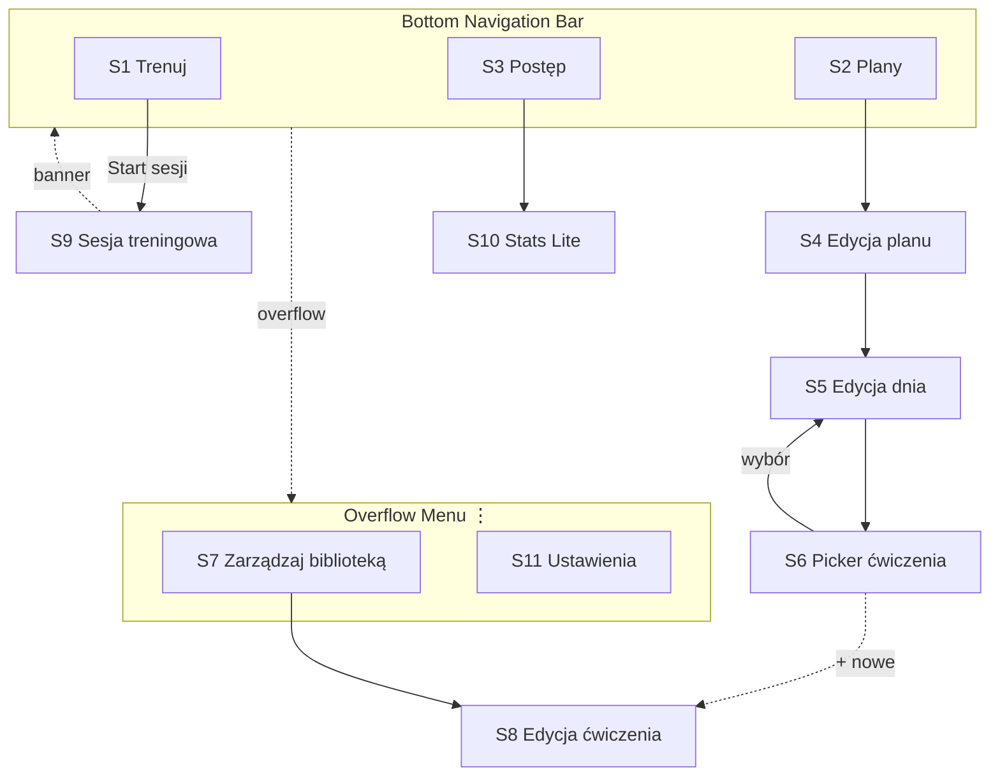
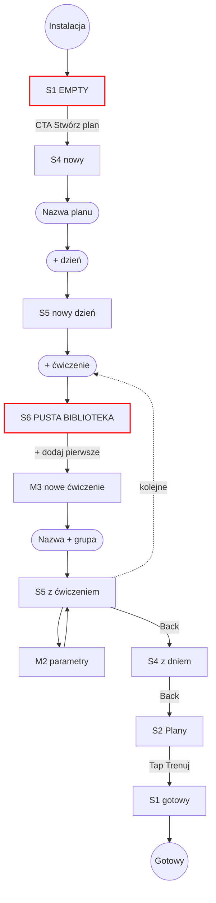
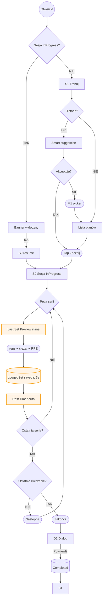
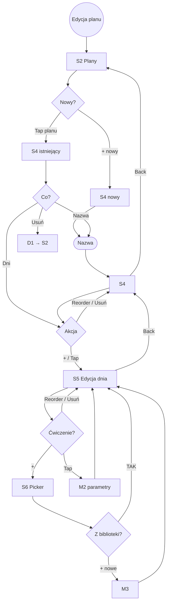
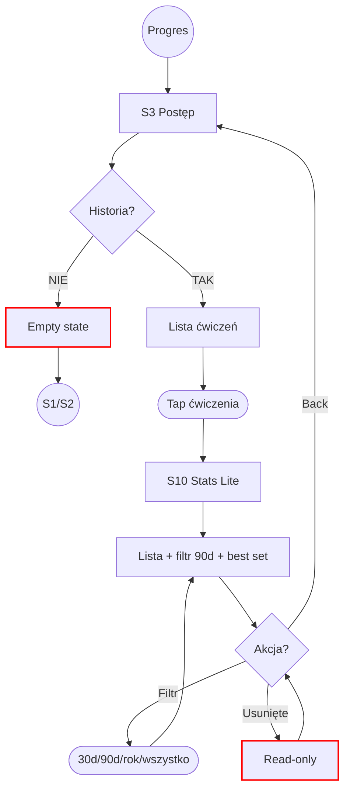

# User Flows + Information Architecture — PainZone 2.0

> TL;DR: 3 top-level tabs (Trenuj/Plany/Postęp) + 11 ekranów + 5 modali — tabele, navigation map, flowy 4 scenariuszy.
>
> Zatwierdzony: 2026-05-26.

---

## 1. Decyzja IA

| Element | Decyzja | Uzasadnienie |
|---------|---------|--------------|
| **Wzorzec nav** | Bottom navigation bar | Branżowy default (Hevy, Strong), thumb-friendly |
| **Liczba zakładek** | **3: Trenuj / Plany / Postęp** | Bez social/preset/profile nie ma czym zapełnić więcej |
| **Aktywna sesja** | Persistent banner u góry gdy `WorkoutSession.state == InProgress` | PRD 4.3 AC4 |
| **Biblioteka ćwiczeń** | Schowana — picker w Plany + overflow "Zarządzaj biblioteką" | Rzadka aktywność, ~20 pozycji |
| **Settings** | Overflow ⋮ | MVP Settings praktycznie puste |
| **FAB** | Brak | "Trenuj" = zakładka, 1-tap z każdego miejsca |
| **Zakładka Trenuj** | Hybryd: smart sugestia u góry + pełna lista poniżej | USP "min. kliknięć" + manual pick |
| **Wizualny styl bottom bara** | Odroczone do Fazy 4 | Decyzja stylistyczna |

```
┌──────────────────────────────────┐
│ ⏺ Aktywna: Push 3/12  →         │  ← persistent banner (tylko gdy InProgress)
├──────────────────────────────────┤
│   PainZone               [⋮]     │  ← TopAppBar + overflow
├──────────────────────────────────┤
│   (content per zakładka)         │
├──────────────────────────────────┤
│  [Trenuj]  [Plany]  [Postęp]    │  ← bottom navigation bar (3 tabs)
└──────────────────────────────────┘
```

---

## 2. Inwentarz ekranów

### Top-level

| ID | Ekran | Purpose | Mapowanie |
|----|-------|---------|-----------|
| **S1** | Trenuj | Smart suggestion + lista planów/dni | PRD 4.3 |
| **S2** | Plany | Lista planów + CRUD | PRD 4.2 |
| **S3** | Postęp | Lista ćwiczeń z historią | PRD 4.6 |

### Sub-screens

| ID | Ekran | Purpose | Entry | Exit | Mapowanie |
|----|-------|---------|-------|------|-----------|
| **S4** | Edycja planu | CRUD planu + dni | S2 | tap dnia → S5 · back → S2 | PRD 4.2 |
| **S5** | Edycja dnia | CRUD dnia + ćwiczenia | S4 | + ćwiczenie → S6 · back → S4 | PRD 4.2 |
| **S6** | Picker ćwiczenia | Wybór z biblioteki + inline dodanie | S5 | wybór → S5 · + nowe → M3 → S5 | PRD 4.1 |
| **S7** | Zarządzaj biblioteką | CRUD ćwiczeń (globalne) | Overflow ⋮ | tap → S8 · back | PRD 4.1 |
| **S8** | Edycja ćwiczenia | Nazwa + grupa mięśniowa | S7 / M3 | zapisz → S7 | PRD 4.1 |
| **S9** | Sesja treningowa | Logowanie serii + Last Set Preview + Rest Timer | S1 / banner | "Zakończ" → D2 → S1 | PRD 4.3–4.5 |
| **S10** | Stats Lite | Lista serii + filtr + best set | S3 | back → S3 | PRD 4.6 |
| **S11** | Ustawienia | O aplikacji + reset | Overflow ⋮ | back | — |

### Modale / dialogi

| ID | Element | Trigger |
|----|---------|---------|
| **M1** | Picker plan/dzień | S1 "zmień plan/dzień" |
| **M2** | Parametry ćwiczenia w planie | S5 → tap ćwiczenia |
| **M3** | Nowe ćwiczenie | S6 "+ dodaj nowe" |
| **D1** | Dialog usunięcia | S4 / S7 "Usuń" |
| **D2** | Dialog "Zakończ sesję" | S9 "Zakończ sesję" |

### Empty states

- **S1** brak planów → CTA "Stwórz pierwszy plan" → S4
- **S2** pusto → CTA "Stwórz pierwszy plan" → S4
- **S3** pusto → "Brak historii — zakończ pierwszą sesję"
- **S6** pusta biblioteka → "Biblioteka pusta — [+ dodaj pierwsze ćwiczenie]"
- **S7** pusto → CTA "Dodaj pierwsze ćwiczenie" → S8

---

## 3. Navigation map



---

## 4. Flow diagrams

### 4.1 Pierwsze uruchomienie



### 4.2 Zacznij trening



### 4.3 Stwórz / edytuj plan



### 4.4 Zobacz progres



---

## Referencje

`docs/02-prd.md` · `docs/04-wireframes.md` · `docs/glossary.md`